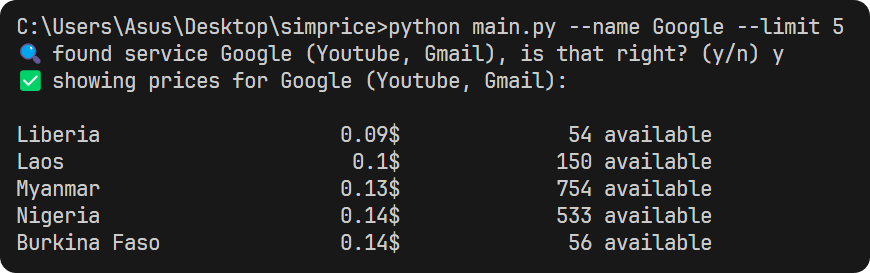

<h3 align="center"></h3>
<h1 align="center">SimPrice</h1>

Get the cheapest numbers from OnlineSim effortlessly.
 

SimPrice is an efficient tool designed to help users find the most affordable virtual numbers from OnlineSim. It streamlines the process of comparing prices, enabling you to secure the best deals quickly and easily. With SimPrice, you can save time and money while accessing the virtual numbers you need.

### Options
- `id` — exact service ID (e.g. `instagram`, `openai`)
- `name` — name of the service to search for (e.g. `Instagram`, `Google`)
- `limit` — limit of the given prices (default: `10`)
- `lang` — language for queries and results (default: `en`)
